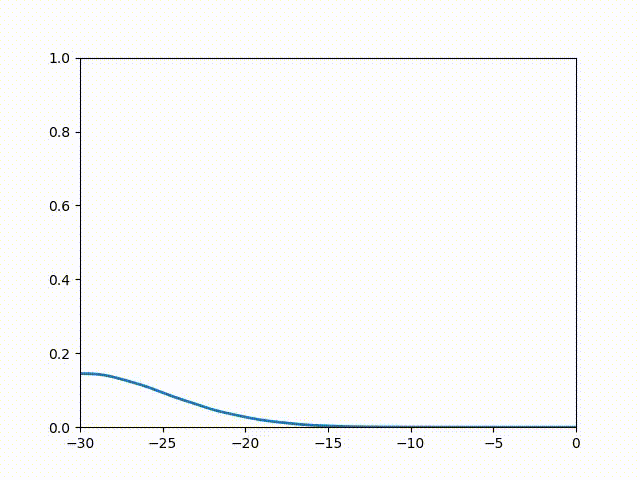

## Reflection of a Wavepacket Off a Step Potential

This is an animation of Problem 1 Week 9 in MITx: 8.94.3x Quantum Mechanics: 1D Scattering and Central Potentials

### Set up
We send in a wavepacket from negative infnity of x to a step potential with some step height, the total energy of the wavefacket is less than the step potential.

